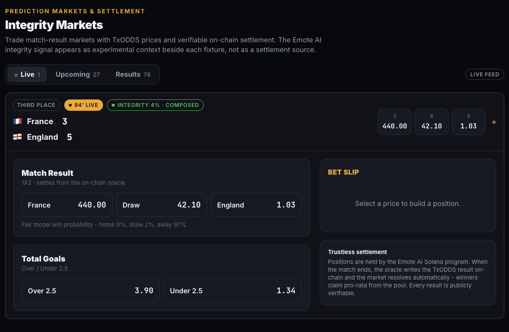

# Emote AI

On-chain match integrity for the World Cup - webcam-grade biometrics as an **experimental context signal**, paired with verifiable TxODDS result settlement on Solana.



*Integrity Markets: live France v England with TxODDS prices and the experimental integrity chip (`INTEGRITY 4% · COMPOSED`) beside the board - context only, not a settlement source.*

> **Honesty note:** detection is real (rPPG heart-rate/HRV, EAR fatigue, expression). The integrity / suspicion score is an **experimental heuristic for entertainment - not a lie detector and not evidence of wrongdoing.** Facial and physiological deception detection is not scientifically reliable. We show the signal transparently, and markets settle from the result oracle - never from the integrity chip.

## What it is

One codebase, three surfaces, one shared feed:

| Route | Product | Track |
|-------|---------|-------|
| [`/markets`](./app/markets) | **Integrity Markets** - match-result markets, priced by TxODDS, settled by a Solana oracle | Prediction Markets & Settlement |
| [`/matchday`](./app/matchday) | **The Integrity Room** - fan picks against live integrity readings | Consumer & Fan |
| [`/terminal`](./app/terminal) | **Sentinel** - agent that scans odds edges with integrity as context | Trading Tools & Agents |
| [`/analyze`](./app/analyze) | Shared detection core - webcam or clip → HR, stress, fatigue, expression | - |
| [`/verify`](./app/verify) | Recompute the sha256 evidence hash for settled results | - |
| [`/wiki`](./app/wiki) | Methods & research references behind each measure | - |

## How it works

1. **Emote AI reads the face** - webcam or match clip → heart rate (rPPG), stress, fatigue (EAR / blinks / PERCLOS), expression.
2. **Signal with context** - a composite suspicion score sits beside the match feed as an experimental context layer.
3. **Markets · Room · Sentinel** - each surface shares the same match feed, pricing model, and public result hash.

Positions are held by the Solana program. When the match ends, the oracle writes the TxODDS result on-chain and the market resolves; winners claim pro-rata. Anyone can recompute the evidence hash on [`/verify`](./app/verify).

## Signals & research

Full write-up with citation links: **[`/wiki`](./app/wiki)**.

| Measure | Method | Research anchor |
|---------|--------|-----------------|
| **Fatigue** | Eye Aspect Ratio (EAR), blink counting, PERCLOS over a rolling window | Soukupová & Čech, *Real-Time Eye Blink Detection using Facial Landmarks* ([CVWW 2016](https://vision.fe.uni-lj.si/cvww2016/proceedings/papers/05.pdf)); Dinges & Grace, [PERCLOS](https://rosap.ntl.bts.gov/view/dot/313) |
| **Heart rate** | Remote PPG via Plane-Orthogonal-to-Skin (POS) on forehead / cheek RGB | Wang et al., *Algorithmic Principles of Remote-PPG* ([IEEE TBME 2017](https://doi.org/10.1109/TBME.2016.2609282)); Verkruysse et al. ([Opt. Express 2008](https://doi.org/10.1364/OE.16.021434)) |
| **Stress / arousal** | HR rise + RMSSD drop vs a personal resting baseline | ESC/NASPE [HRV standards](https://doi.org/10.1161/01.CIR.93.5.1043); Thayer et al. on HRV and stress |
| **Expression** | MediaPipe blendshapes → seven-class heuristic (not a trained FER net) | [MediaPipe Face Landmarker](https://developers.google.com/mediapipe/solutions/vision/face_landmarker); FACS as conceptual background |
| **Integrity chip** | Weighted fusion of expression heuristics + arousal, gated by signal quality | Experimental entertainment heuristic only - see [Bond & DePaulo](https://doi.org/10.1207/s15327957pspr1003_2), [NRC polygraph review](https://nap.nationalacademies.org/catalog/10448/the-polygraph-and-lie-detection) |

Implementation: `lib/emote/` (`face.ts`, `rppg.js`, `fatigue.js`, `stress.js`, `emotion.js`, `integrity.ts`). Processing runs in the browser; video never leaves the device.

## Stack

- **App:** Next.js, React, Tailwind
- **Face / biometrics:** MediaPipe Face Landmarker (client-side)
- **Odds / scores:** TxLINE / TxODDS (`lib/txodds/`, setup at `/setup/txline`)
- **Settlement:** Solana program + oracle evidence hash (`/verify`)

## Run locally

```bash
yarn install
yarn dev
```

Open [http://localhost:3000](http://localhost:3000). Camera APIs need a secure context (`localhost` is fine).

For live TxODDS pricing, configure TxLINE credentials in `.env.local` (see [`docs/TXLINE_ENDPOINTS.md`](./docs/TXLINE_ENDPOINTS.md) and `/setup/txline`). Without live keys, the app falls back to the mock provider.

## Time-travel simulation

When the live feed has no open matches, the home ticker and markets board show a **Simulate matchday** picker. You can also open it anytime with **Simulate date** to test the flow while games are still available.

This is still live-source driven when TxLINE is configured: the app loads real TxLINE World Cup fixtures, kickoffs, teams, odds snapshots, closing lines, and known scores, then projects the board as if the selected date/time were "now." Mock data is only used when live mode is not configured or the live fetch cannot return usable data.

Past in-play score ticks are not exposed by TxLINE, so a simulated live minute uses a projected partial score from the known final score. Markets, MatchDay, Sentinel, and market detail all share the same selected timestamp until you click **Exit**.

## Docs

- [`docs/SUBMISSIONS.md`](./docs/SUBMISSIONS.md) - track pitches and demo outlines
- [`docs/TXLINE_ENDPOINTS.md`](./docs/TXLINE_ENDPOINTS.md) - TxLINE auth and data endpoints
- [`/wiki`](./app/wiki) - in-app methods & research page

## License

Prototype for TxODDS × Solana World Cup hackathon use. Devnet only unless otherwise configured.
